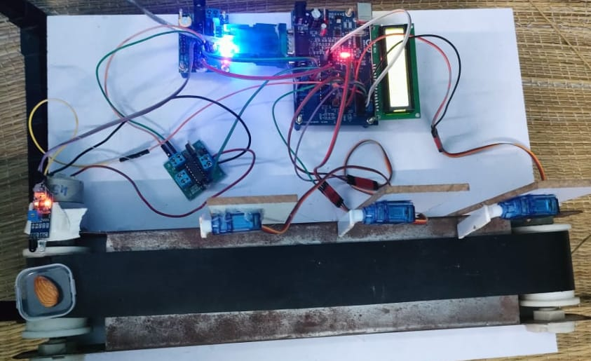
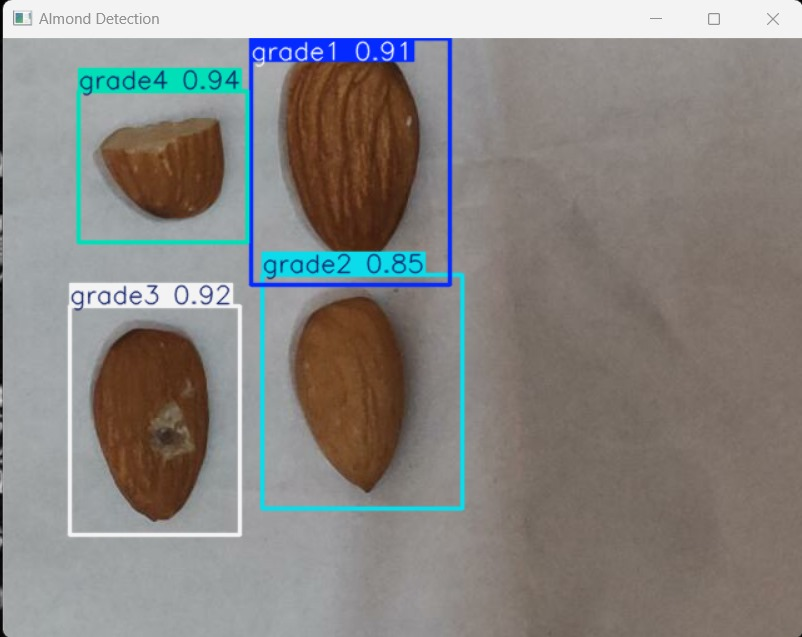

# 🥜 Nut Sorting and Grading System using YOLOv8 and OpenCV

This project implements a **real-time nut sorting and grading system** using **YOLOv8** for object detection and **OpenCV** for image processing automation. The system is built with both hardware (Arduino-based) and software components (Python, OpenCV, and Deep Learning).

## 📌 Project Features

- ✅ Real-time object detection and classification of nuts
- 🧠 Trained YOLOv8 model for high accuracy
- 📷 Webcam-based live detection
- 🔧 Arduino integration for mechanical nut sorting
- 🗂 Dataset collection, augmentation, and training pipeline
- 🧪 Test video and result images included

---

## 📁 Project Structure

```
├── Dataset_Base/               # Base dataset of nut images
├── runs/detect/                # YOLO detection results
├── train/                      # Training dataset
├── valid/                      # Validation dataset
├── FINAL.py                    # Final integrated detection script
├── webcam_detection.py         # Live webcam nut detection
├── augment_data.py             # Script to augment training data
├── import cv2.py               # OpenCV module usage
├── import os.py                # OS module usage
├── data.yaml                   # YOLOv8 data configuration
├── yolov5su.pt                 # YOLOv5 model (optional)
├── yolov8n.pt                  # YOLOv8 model (main)
├── yolo11n.pt                  # Another model version
├── nut_sorting_system.ino      # Arduino code for sorting hardware
├── nuts sorting vedio (1).mp4  # Demo video
├── result nuts.jpg             # Result snapshot of sorted nuts
├── project photo1.jpg          # Hardware image
├── project photo2.jpg          # Hardware image
├── Batch 11-...pptx            # Project presentation
├── plagiarism Batch 11...pdf   # Plagiarism check report
```

---

## 🚀 How to Run

1. **Clone the Repository**

```bash
git clone https://github.com/your-username/your-repo-name.git
cd your-repo-name
```

2. **Install Dependencies**

Make sure Python and pip are installed.

```bash
pip install -r requirements.txt
```

(You can create `requirements.txt` with packages like: `opencv-python`, `ultralytics`, `numpy`, etc.)

3. **Run Detection**

```bash
python FINAL.py
# or
python webcam_detection.py
```

---

## ⚙️ Hardware Integration

- **Microcontroller**: ATmega328 (Arduino UNO)
- **Communication**: Uses Arduino script `nut_sorting_system.ino` for controlling hardware based on detection results
- **Sorting Mechanism**: Basic actuator logic (can be expanded)

---

## 📊 Model Training

- **YOLOv8** used for object detection
- Data augmentation performed using `augment_data.py`
- Trained weights: `yolov8n.pt`, `yolov5su.pt`, etc.

---

## 📸 Gallery

| Hardware Setup             | Result Image             |
|---------------------------|--------------------------|
|  |  |

---

## 📽️ Demo

Watch the system in action:  
🎥 `nuts sorting vedio (1).mp4`

---

## 📚 Documentation

- Presentation: `Batch 11-41130540 & 41130491.pptx`
- Plagiarism Report: `plagiarism Batch 11-41130540.pdf`

---

## 👨‍💻 Authors

- **Sujay Sarvesh K K**
- **Nandha**

Project under the guidance of **Ms. Nanditha**,  
Sathyabama Institute of Science and Technology  
Department of Electronics and Communication Engineering

---

## 📝 License

This project is for academic and learning purposes. Contact the authors for usage in other contexts.
